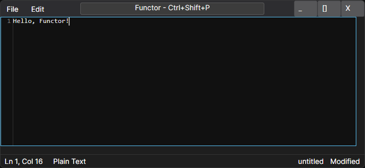

# 

*A functional editor for creative minds.*

Functor is a modern, experimental text editor designed around **clarity**, **predictability**, and **modularity**. It uses a pure **Domain Core** and a rendering pipeline that stays backend-neutral, with Avalonia as the current concrete frontend and drawing backend.

The architecture is inspired by how real editors evolved: VSCode/Monaco, Lapce, Zed, Xi, Helix, and Neovim. Functor is built to scale beyond a single UI, supporting multiple frontends, agentic workflows, LSP, plugins, and workspace‑level features.

The current implementation already includes a clear render pipeline:

- pure domain state and editing logic
- viewport-aware slicing and layout computation
- a geometry-first `RenderingModel`
- a backend boundary for rendering adapters
- current concrete drawing through Avalonia

This keeps the editor core portable while leaving room for a future Skia-specific backend behind the same abstraction.

---

## Screenshots



---

## ✨ Goals

- A clean, predictable MVU-style architecture
- Pure rendering pipeline with backend abstraction
- Avalonia-first concrete backend today
- Cross‑platform support (Desktop, Browser, Mobile)
- Modular domain subcomponents
- Workspace‑aware architecture
- Syntax highlighting + LSP integration
- Agentic workflows (A2A, MCP)
- F#‑first ergonomics and composability
- Long-term maintainability
- A future Skia backend behind the same abstraction model

---

## Building Functor

Build-script **help** requires the F# Interactive delimiter:

```
dotnet fsi .\build\build.fsx -- --help
```

Use **custom** parameters, for example:


```
dotnet fsi .\build\build.fsx --configuration Debug --runtimeIdentifier win-x64 --outputRoot out --outputDirectory out/win-x64
```

Or you can run **build-release-win-x64.fsx**, which invokes the reusable script with the Release win-x64 settings:

```
dotnet fsi .\build\build-release-win-x64.fsx
```

---