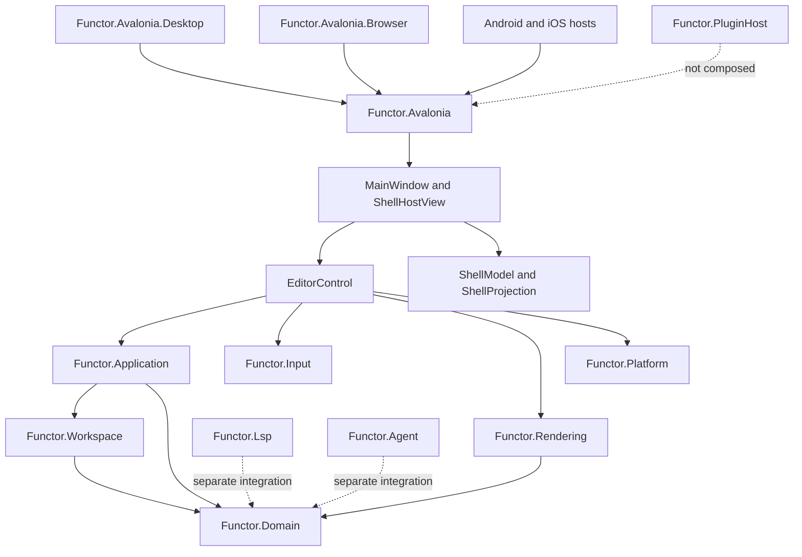
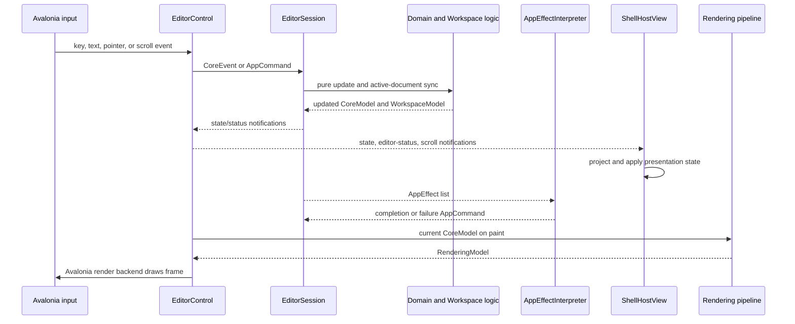

# Functor Current Architecture

This document describes the implementation currently present in the working tree. It is intentionally limited to code that is compiled or directly exercised by the active Avalonia frontend; roadmap and plugin documents describe future direction rather than current runtime behavior.

## Overview

Functor is an F#/.NET 10 text editor with framework-independent domain, workspace, application, input, and rendering layers. Avalonia is the current concrete frontend and rendering backend. The desktop host is the clearest runtime entry point, while browser, Android, and iOS hosts reuse the shared Avalonia application.

The principal architectural addition in the current worktree is a shell layer in `Functor.Avalonia`. `ShellModel` owns only shell layout state, `ShellProjection` derives presentation data from `EditorControl` and `AppSessionState`, and `ShellHostView` applies that projection to tabs, status, scrolling, empty-state visibility, and a side panel.

## Project Responsibilities

### Domain, workspace, and application

- `Functor.Domain` defines the immutable `CoreModel`, domain events, and pure update logic for documents, editing, syntax, navigation, diagnostics, mode, and view state.
- `Functor.Workspace` owns workspace-level document sessions, tab ordering, the active document, recent documents, workspace settings, and workspace projections. Each workspace document carries the corresponding editing, syntax, navigation, diagnostics, mode, and view state.
- `Functor.Application` is the stateful orchestration boundary. `AppSessionState` combines `CoreModel`, `WorkspaceModel`, and `SessionStatus`; `EditorSession` coordinates transitions, synchronization, notifications, tokenization, saves, and external-effect requests.

`EditorSession` is imperative around the pure domain and workspace updates. Before a domain update it writes the active `CoreModel` document state back into the workspace. After document close or activation it reconstructs `CoreModel` from the active workspace document. This keeps the active editing model and the stored per-document sessions aligned.

### Input and rendering

- `Functor.Input` defines platform-neutral keyboard, pointer, text-input, editor-action, and shell-action concepts and keymaps.
- `Functor.Rendering` converts a `CoreModel` into a backend-neutral `RenderingModel`. The pipeline slices visible lines, calculates layout for text, tokens, selections, cursors, diagnostics, and line numbers, and does not draw directly.
- `Functor.Avalonia.InputAdapter` converts Avalonia input into `Functor.Input` concepts. `AvaloniaRenderBackend` draws the rendering model through Avalonia's `DrawingContext`.

### Avalonia frontend

`AvaloniaApp` creates `MainWindow` for desktop lifetimes and `ShellHostView` for single-view or activity lifetimes. `MainWindow` supplies the desktop title bar, menus, command-palette overlay, settings/theme management, recent-document menu, and per-workspace layout persistence.

`ShellHostView` contains the editor, welcome surface, document tabs, an active-tab toolbar, scrollbars, status bar, and an auxiliary host. It subscribes to editor state, status, and scroll notifications only while attached to the visual tree. On each notification it builds `ShellViewInput` through `ShellProjection` and applies it through `ShellView`.

`PerDocumentSessionState.Auxiliary` owns the live notebook and agent visibility choices for each document tab. `WorkspaceLogic` updates these choices through `SetNotebookOpen` and `SetAgentOpen` events, and `EditorSession` exposes them through application commands while preserving them during tab switches. `ShellProjection` derives the active tab's choices, and `ShellHostView` renders independent Notebook and Agent toolbar toggles above the editor. Both placeholders may be open simultaneously in the temporary auxiliary host; notebook execution and agent/MCP integration remain future adapters.

`ShellModel` retains only shared auxiliary-host geometry and animation state. The active tab's workspace state is the sole source of truth for Notebook and Agent visibility; panel selection and global open state are no longer represented in the shell or persisted layout.

`EditorControl` remains the composition root for one editor session. It constructs `EditorSession`, concrete clipboard/file/dialog/tokenizer services, and `AppEffectInterpreter`. It translates raw Avalonia input, dispatches editor/application commands, invalidates after state changes, calculates scroll bounds, and invokes the pure rendering pipeline during `Render`.

## State and Effect Flow

External work is represented by `AppEffect` values. `AppEffectInterpreter` executes file, dialog, clipboard, and tokenization operations through injected interfaces, then dispatches result commands to the session. Tokenization is debounced for 150 ms, cancellable, and tracks incremental document changes. Save tracking records the document id, revision, expected path, and saved buffer so delayed completions do not incorrectly mark newer document contents clean.

## Integration Boundaries

- `Functor.Lsp` contains LSP protocol/client building blocks but is not in the active desktop composition path.
- `Functor.Agent` contains MCP-related code and is likewise not composed into the editor session or shell.
- `Functor.PluginHost` defines plugin-related types, but `PluginPanel` in the shell is only a layout variant and has no plugin-host integration.
- Avalonia is the only concrete rendering backend wired into the application.

## Tests and Verification

Tests are divided into domain, application, rendering, workspace, input, and Avalonia projects, all targeting `net10.0`. The current worktree adds focused tests for shell model updates, projections, view nodes, shell application, host behavior, and workspace-layout persistence, replacing the former `MainView` test surface.

The current `Functor.Avalonia` project builds successfully with `dotnet build src/Functor.Avalonia/Functor.Avalonia.fsproj --no-restore`.

## Current Transitional Areas

- The frontend coordinates through Avalonia code-behind and .NET event subscriptions. `ShellModel` makes the side-panel layout update pure.
- The shell's notebook, agent, and plugin panels are visible layout placeholders rather than functional integrations.
- `EditorControl` still owns session/service composition, so a session is scoped to each control instance rather than supplied by an application-level dependency container.
- Browser and mobile hosts exist, but desktop remains the most complete and directly verified host path.
