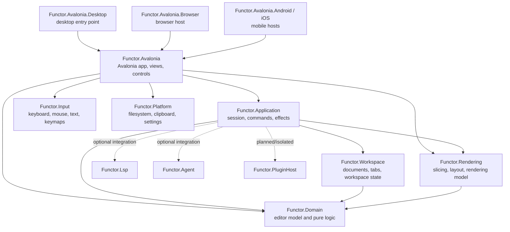
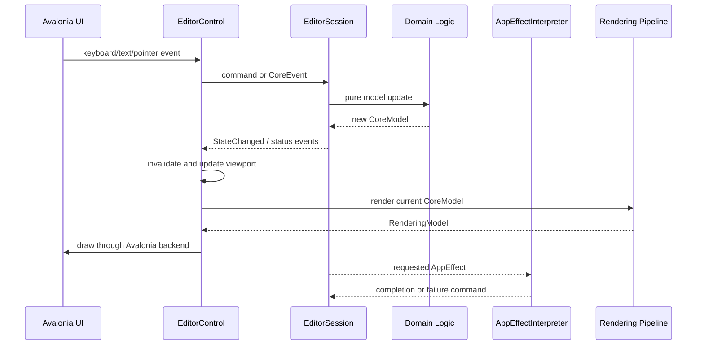

# Functor Previous Architecture

This document describes the architecture implemented in the repository today. It complements the broader architectural direction in `project_architecture.md` and the future-oriented plugin design in `plugin_architecture.md`.

## Overview

Functor is an F#/.NET 10 text editor built around a pure domain model, an application session coordinator, a backend-neutral rendering pipeline, and an Avalonia frontend.

The current runtime is primarily an Avalonia application. The domain, rendering, application, workspace, and input projects are separated so that editor behavior does not depend directly on Avalonia or a specific drawing API.

## Projects and Responsibilities

### `Functor.Domain`

The domain project contains the editor's framework-independent state and behavior. Its code is organized by subdomain:

- `Core`: the aggregate editor model and core events/logic
- `Document`: document identity, metadata, and document operations
- `Editing`: buffer changes, cursor movement, selections, and editing events
- `Syntax`: syntax state and syntax events/logic
- `Navigation`: navigation state and behavior
- `Diagnostics`: diagnostics state and behavior

The domain logic is functional: events are applied to immutable models and return updated models. It has no Avalonia dependency and is the foundation for tests and higher layers.

### `Functor.Rendering`

The rendering project turns domain state into backend-independent geometry and display data. Its main stages are:

1. Convert `CoreModel` into rendering input.
2. Slice the visible portion of the document.
3. Lay out lines, text runs, tokens, selections, cursors, diagnostics, and line numbers.
4. Produce a `RenderingModel`.
5. Leave actual drawing to an `IRenderBackend` implementation.

`RenderingPipeline.render` is pure and deterministic. It does not create Avalonia controls or draw directly.

### `Functor.Workspace`

The workspace project manages workspace-level state around the domain model:

- open documents and tab order
- active document
- per-document editing, syntax, navigation, diagnostics, mode, and view state
- recently closed documents
- workspace settings and lifecycle operations
- projections and queries used by the UI

`WorkspaceModel` stores document session state while the active document is also projected into the `CoreModel` used by the editor session.

### `Functor.Application`

The application project is the framework-agnostic orchestration layer. It contains:

- `AppSessionState`: combined domain model, workspace model, and session status
- `EditorSession`: mutable session coordinator around immutable domain updates
- `AppCommand`: UI/application commands
- `AppEffect`: descriptions of file, clipboard, dialog, and tokenization effects
- `AppEffectInterpreter`: executes effects through injected service interfaces
- tokenization services and incremental tokenization coordination
- application settings, themes, command palette state, and editor status

`EditorSession` receives domain events and application commands, updates the domain and workspace state, publishes state/status events, and requests effects. The application layer does not know how Avalonia implements a dialog, file service, clipboard, or drawing surface.

The session coordinator also handles editor-specific workflow concerns such as:

- dirty-document confirmation before opening or closing
- synchronizing the active document with workspace state
- switching and reopening documents
- scheduling cancellable tokenization after edits
- tracking pending saves by document and revision

### `Functor.Input`

The input project defines platform-independent input concepts and keymaps:

- keyboard input
- mouse input
- text input
- editor and shell keymaps

It does not depend on Avalonia. The Avalonia frontend translates Avalonia input events into these concepts through `InputAdapter.fs`.

### `Functor.Platform`

The platform project provides shared application services such as filesystem access, clipboard abstractions, settings paths, and utility types. The application layer defines service interfaces; concrete frontend/platform code supplies implementations.

### `Functor.Avalonia`

This is the current concrete frontend and drawing backend. It contains:

- Avalonia application initialization
- XAML views and F# code-behind
- `EditorControl`, the custom editor control
- command palette, settings, welcome, main view, and main window surfaces
- Avalonia clipboard, dialog, and rendering services
- `InputAdapter`, which maps Avalonia events to `Functor.Input`
- `AvaloniaRenderBackend`, which implements the rendering backend
- `RenderingSurface`, which connects rendering data to Avalonia drawing

`EditorControl` owns an `EditorSession`, constructs the concrete services and `AppEffectInterpreter`, subscribes to session events, invalidates the control when state changes, and handles pointer/keyboard/text interaction. It invokes the pure rendering pipeline during painting and delegates drawing to the Avalonia backend.

`MainView` binds the editor control to scroll bars, tabs, welcome state, status text, and discard confirmation. `MainWindow` handles the application shell, menu commands, recent-document menus, command palette, settings, theme application, and desktop window controls.

### Platform hosts

- `Functor.Avalonia.Desktop` is the active desktop entry point. It configures Avalonia and starts the classic desktop lifetime.
- `Functor.Avalonia.Browser` provides a browser host project.
- `Functor.Avalonia.Android` and `Functor.Avalonia.iOS` provide mobile host projects, with their inclusion in the solution/build depending on the current solution configuration.

All hosts reuse the shared `Functor.Avalonia` application and views.

### `Functor.Lsp`

This project contains protocol, client, type, and JSON-RPC building blocks for Language Server Protocol integration. It is currently a separate integration project and is not part of the primary Avalonia editor-session dependency path described above.

### `Functor.Agent`

This project currently contains the MCP integration entry point. It is separate from the core editor session and frontend composition.

### `Functor.PluginHost`

This project contains plugin model, API, and loader types. The repository also contains a draft plugin architecture describing a future MVU-oriented plugin system. The plugin host is not currently wired into the main Avalonia startup path.

## Runtime Data Flow

A typical edit follows this path:

1. Avalonia raises a keyboard or text-input event.
2. `Functor.Avalonia.InputAdapter` maps the event to an input action or `EditingEvent`.
3. `EditorControl` dispatches an `AppCommand` or `CoreEvent` to `EditorSession`.
4. `EditorSession` calls pure domain logic to produce the next `CoreModel`.
5. The session synchronizes active-document state with `WorkspaceModel` when required.
6. The session publishes state and editor-status events.
7. `EditorControl` invalidates its visual surface and updates scroll state.
8. Edits can schedule cancellable tokenization through `AppEffect`.
9. `AppEffectInterpreter` executes external work and dispatches completion or failure commands back into the session.
10. On paint, the rendering pipeline converts the current model into geometry and the Avalonia render backend draws it.

## State Ownership

There are three related state boundaries:

- `CoreModel` owns the active editor domain state.
- `WorkspaceModel` owns open-document and workspace state, including per-document session state.
- `AppSessionState` combines the domain model, workspace model, and user-visible session status.

`EditorSession` is the state transition boundary. The underlying domain transitions are pure, but `EditorSession` is an imperative coordinator because it publishes .NET events, schedules asynchronous tokenization, tracks pending saves, and requests external effects.

The Avalonia views do not independently own editor data. They maintain presentation details and call public operations on `EditorControl`/`EditorSession`; session events drive UI updates.

## External Effects and Services

External work is represented as `AppEffect` values and executed by `AppEffectInterpreter`. Service interfaces keep the application layer testable and platform-neutral:

- `IFileService` for reading and writing files
- `IClipboardService` for clipboard access
- `IDialogService` for open/save/folder dialogs
- `ITokenizerService` for syntax tokenization

The Avalonia project supplies concrete implementations for clipboard and dialogs. File and settings behavior is provided through the platform/application service composition. Effect completion is returned to the session as application commands rather than directly mutating domain state.

## Testing Architecture

The test solution contains separate projects for:

- application behavior and tokenization
- Avalonia controls and views
- domain logic
- input mapping
- rendering
- workspace behavior

The tests target `net10.0`. The repository uses the Microsoft Testing Platform configuration in `global.json`. Most test projects use xUnit v3 4.0.1; the Avalonia test project currently uses xUnit v3 3.2.2 because the latest `Avalonia.Headless.XUnit` package in use depends on xUnit core 3.2.2.

## Current Boundaries and Transitional Areas

The architecture is intentionally split, but several areas remain transitional:

- The current frontend uses event subscriptions and direct code-behind coordination alongside the application session model.
- Avalonia is the only concrete rendering backend currently wired into the editor.
- Browser and mobile host projects exist, but the desktop host is the clearest active runtime path.
- LSP, MCP/agent, and plugin projects exist as integration boundaries but are not all connected to the primary startup composition.
- The plugin architecture document describes intended capabilities and guarantees; it should not be read as evidence that all of those runtime capabilities are implemented today.

## Architectural Principles in the Current Code

- Keep editor state and transformations in framework-independent F# modules.
- Represent state transitions as domain events and pure logic functions where possible.
- Keep rendering computation separate from drawing APIs.
- Express I/O and asynchronous work as application effects.
- Inject platform services at the application/frontend boundary.
- Keep workspace state separate from the active document's domain state while synchronizing them through the session coordinator.
- Reuse the application and domain layers across frontend hosts.
