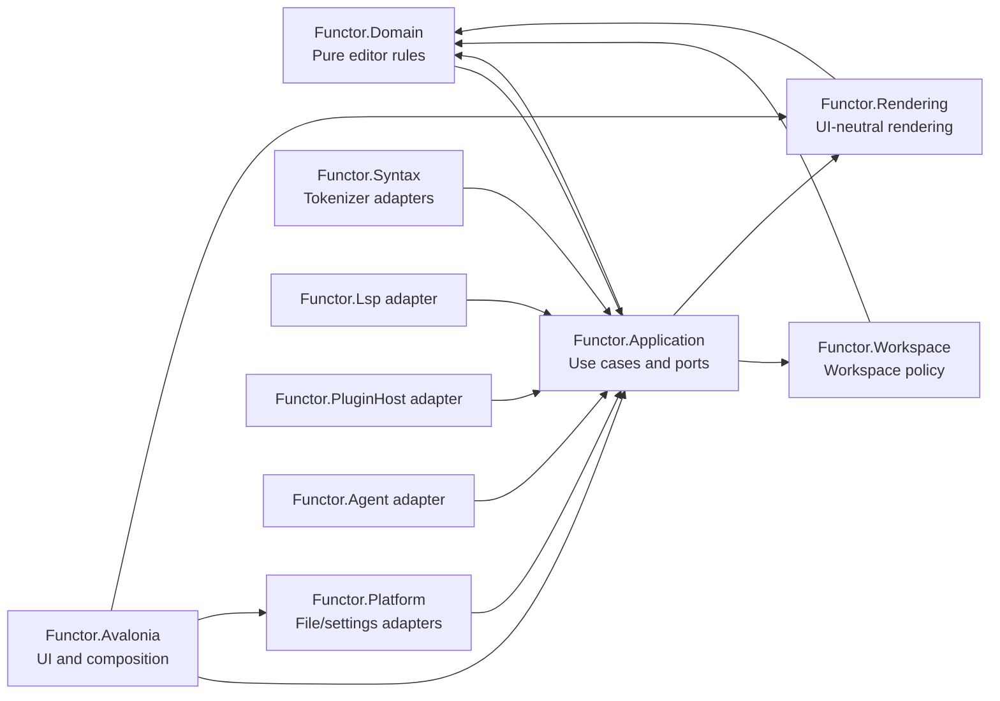

# Architecture Review TODO

## Purpose

This roadmap prepares Functor for multiple frontends, language integrations, plugins, and agent workflows without weakening the existing functional core. It applies Clean Architecture incrementally: business policy and use-case orchestration depend only on inner contracts; framework, file-system, protocol, and UI implementations remain replaceable outer adapters.

This is a refactoring plan, not a rewrite. Preserve working behavior, public user workflows, and the practical MVU guidance in [practical_guidelines.md](../architecture/practical_guidelines.md).

## Current Findings

The existing dependency direction has a strong foundation:

- `Functor.Domain` is dependency-free and organizes editor rules by subdomain.
- `Functor.Rendering` and `Functor.Workspace` depend inward on `Functor.Domain`.
- `Functor.Avalonia` is an outer adapter that references application, domain, input, platform, and rendering code.
- Tests are already separated by project and include focused application, domain, workspace, rendering, and Avalonia suites.

The application project is currently the principal scaling risk. Its project file compiles use-case state and orchestration beside concrete syntax tokenizers, JSON/theme loaders, and application-facing service interfaces. This gives one project several independent reasons to change and makes the boundary between policy, ports, and implementations unclear.

`Functor.Platform` references `Functor.Application`, which is acceptable only while it is an outer adapter implementing application-owned ports. The ownership needs to be made explicit and enforced. Plugin, LSP, and agent projects should follow the same adapter rule when they begin participating in editor workflows.

## Target Architecture



### Dependency Rules

- `Functor.Domain` references no Functor project and no UI, I/O, protocol, or serialization library.
- `Functor.Application` contains use cases, application state, commands, effects, and port contracts. It may reference domain, workspace, and rendering policy, but never Avalonia, platform implementations, LSP, plugins, MCP, file-system APIs, or serialization implementations.
- `Functor.Workspace` and `Functor.Rendering` remain UI- and platform-neutral. They must not reference `Functor.Application`.
- Adapter projects (`Functor.Platform`, `Functor.Syntax`, `Functor.Lsp`, `Functor.PluginHost`, `Functor.Agent`, and `Functor.Avalonia`) may reference inner projects to implement or invoke their contracts, but inner projects must never reference them.
- The executable host is the composition root. It chooses concrete adapter implementations and passes them into application coordinators.
- A project reference must express a stable ownership relationship. Do not add a reference only to reuse a convenience type; move that type inward or duplicate a small adapter-local representation.

### Proposed Source Layout

Keep existing projects initially, but organize code by ownership. Create projects only when a module has a stable independent dependency or release cadence.

```text
src/
  Functor.Domain/
    Editing/ Document/ Search/ Syntax/ Navigation/ Diagnostics/ Core/
  Functor.Application/
    Ports/                 # File, clipboard, dialog, settings, tokenization contracts
    Editor/                # Session transitions, persistence coordination, tokenization coordination
    Shell/                 # Command catalog, shell state, palette state
    Settings/              # Settings form, validation, projection, application policy
    Themes/                # Theme policy and application models
    Composition/           # Dependency records only; no concrete construction
  Functor.Workspace/
    Model/ Queries/ Lifecycle/ Projections/
  Functor.Rendering/
    Model/ Layout/ Pipeline/ Ports/
  Functor.Syntax/          # New: concrete F#, C#, JSON, and Markdown tokenizer implementations
  Functor.Platform/
    FileSystem/ Clipboard/ Settings/ ThemeCatalog/
  Functor.Avalonia/
    Composition/ Services/ Controls/ Views/ Rendering/
  Functor.Lsp/
    Protocol/ Client/ Adapter/
  Functor.PluginHost/
    Contracts/ Loading/ Adapter/
  Functor.Agent/
    Mcp/ Adapter/
```

F# file order is part of the module contract. Each project should group foundational types and port contracts before implementations that consume them, and keep the explicit order visible in its `.fsproj` file.

## Migration Plan

### Phase 0: Establish Architectural Guardrails

- [x] Document the dependency rules above in [project_architecture.md](../architecture/project_architecture.md) and make it the source of truth for project ownership.
- [x] Add an architecture test or build-time verification that rejects forbidden project references, especially any reference from Domain, Workspace, Rendering, or Application to Avalonia, Platform, LSP, PluginHost, or Agent.
- [ ] Add CI validation that restores, builds, and runs each platform-neutral test project independently.
- [ ] Define a project-reference review checklist: dependency direction, ownership of the referenced type, replacement seam, and test location.
- [ ] Baseline build time, test time, and project-reference graph before moving code; use the baseline to catch unintended coupling or build regressions.

**Exit criteria:** forbidden dependency direction fails the build, and the team can state the owner and allowed dependencies of every project.

### Phase 1: Make Application Ports Explicit

- [ ] Move `IFileService`, `IClipboardService`, `IDialogService`, and `ITokenizerService` beneath an `Application/Ports` ownership boundary while preserving their public behavior.
- [ ] Review `AppEffect` and `AppEffectInterpreter`: retain pure effect descriptions in Application and move all concrete I/O execution to outer adapters or the composition root.
- [ ] Replace broad service dependencies with small capability-specific records or interfaces at the use-case boundary. `EditorServices` may remain a composition record, but do not let it accumulate unrelated services.
- [ ] Specify cancellation, failure, timeout, and stale-result semantics for every asynchronous port. Represent failures as explicit result data where recovery is possible; reserve exceptions for invariant failures and process-level faults.
- [ ] Add contract tests that run each application coordinator against deterministic fake ports and cover cancellation, failure, ordering, and stale-result rejection.

**Exit criteria:** Application can be tested using only fake port implementations and has no direct construction of file, dialog, clipboard, tokenizer, JSON, or framework objects.

### Phase 2: Extract Syntax Implementations From Application

- [ ] Create `Functor.Syntax` as an adapter project that references `Functor.Application` for the tokenizer port and `Functor.Domain` only when syntax model types require it.
- [ ] Move `Tokenizers/TokenizerCommon.fs`, `FSharpTokenizer.fs`, `CSharpTokenizer.fs`, `JsonTokenizer.fs`, `MarkdownTokenizer.fs`, and `DefaultTokenizerService.fs` to `Functor.Syntax`.
- [ ] Keep `IncrementalTokenizationState`, `TokenizationCoordinator`, and `EditorSessionTokenization` in Application because they are use-case scheduling and state-coordination policy.
- [ ] Move tokenizer-specific tests into a new `Functor.Tests.Syntax` project; retain coordinator and fake-tokenizer tests in Application.
- [ ] Register the default tokenizer implementation in the desktop/browser/mobile composition roots rather than inside an application coordinator.

**Exit criteria:** Application defines and consumes tokenization contracts but contains no language-specific tokenization implementation.

### Phase 3: Separate Persistence And Configuration Adapters

- [ ] Classify every settings and theme module by responsibility: application policy and validation remain in Application; JSON parsing, file discovery, environment paths, and file writes move to Platform adapters.
- [ ] Split `ThemeSettingsJson` into a serialization adapter and an application-owned DTO-to-model mapping boundary. Keep externally persisted formats versioned and backward-compatible.
- [ ] Split `AppSettingsLoader` and `ThemeSettingsLoader` so application code requests configuration through a port and does not decide physical paths or perform file I/O.
- [ ] Add versioned schema migration functions for persisted settings and themes. Test loading historical, missing, malformed, and forward-version documents.
- [ ] Ensure save operations are atomic where the platform supports it, preserve a recoverable previous file on failure, and report errors through the established application effect flow.

**Exit criteria:** configuration policy is deterministic and unit-testable; serialization and storage can be replaced without changing application use cases.

### Phase 4: Clarify Use-Case Ownership

- [ ] Organize Application files by feature (`Editor`, `Shell`, `Settings`, `Themes`, `Ports`) rather than by a flat list of technical names.
- [ ] Define a narrow public module surface for each feature. Other features call explicit operations or consume published state, rather than reaching into private state transitions.
- [ ] Keep `EditorSession` as the editor workflow facade and retain the completed split between transitions, tokenization scheduling, and persistence coordination.
- [ ] Keep `ShellState`, command-palette state, and settings-draft state as application-owned state. Avalonia views must project that state and translate input, not introduce another authoritative model.
- [ ] Use discriminated unions for command results and expected failures so outer layers can present errors without interpreting implementation exceptions.
- [ ] Add feature-level tests around public use-case operations; tests should not require an Avalonia control unless the behavior is explicitly a UI projection or lifecycle behavior.

**Exit criteria:** each Application feature has a clear entry point, owned state, ports, and focused test suite; no feature relies on another feature's implementation detail.

### Phase 5: Make Outer Integrations First-Class Adapters

- [ ] Make `Functor.Avalonia` composition explicit: construct platform and syntax adapters once at startup, inject them into application coordinators, and keep controls limited to projection, input adaptation, and framework lifecycle.
- [ ] Define an application-facing LSP adapter contract before allowing LSP operations to mutate editor state. Translate protocol messages at the LSP boundary and keep LSP wire types out of Domain and Application models.
- [ ] Define a plugin capability model with stable, minimal contracts. Plugins receive explicit capabilities rather than access to aggregate application state or direct Avalonia controls.
- [ ] Define MCP/agent commands as application use-case adapters. Agent protocol types remain in `Functor.Agent`; authorization, cancellation, audit events, and capability limits are handled at this outer boundary.
- [ ] Add adapter contract tests for LSP, plugin, and agent translation, including malformed inputs, cancellation, and unsupported capability cases.

**Exit criteria:** each integration can be developed, tested, and replaced without creating an inward dependency or exposing framework/protocol types to core policy.

### Phase 6: Scale Delivery And Observability

- [ ] Add structured application events at use-case boundaries: command name, correlation ID, document/workspace identity, duration, outcome, cancellation, and failure category. Keep payloads free of document content and secrets.
- [ ] Define bounded concurrency per document/workspace for tokenization, persistence, LSP requests, plugin calls, and agent actions. Each workflow needs cancellation ownership and a stale-result rule.
- [ ] Add performance regression tests for large documents, workspace-tree refresh, rapid edits, tab switching, and theme changes. Record deterministic budgets appropriate to CI hardware.
- [ ] Add end-to-end smoke tests for desktop composition and each enabled frontend, covering open, edit, save, tokenize, search, and settings workflows.
- [ ] Publish a compatibility policy for persisted settings/themes, plugins, LSP protocol support, and agent capabilities before external extensions depend on them.

**Exit criteria:** operational failures can be attributed to a use case and adapter, asynchronous workloads have bounded ownership, and releases verify the critical editor workflow across supported hosts.

## Production Implementation Patterns

Use ports in the application layer and implementations in outer projects:

```fsharp
// Functor.Application/Ports/ITokenizerService.fs
type ITokenizerService =
    abstract TokenizeAsync: document: DocumentModel * cancellationToken: CancellationToken -> Task<Result<SyntaxTokens, TokenizationError>>

// Functor.Syntax/DefaultTokenizerService.fs
type DefaultTokenizerService(...) =
    interface ITokenizerService with
        member _.TokenizeAsync(document, cancellationToken) =
            // Select and execute concrete language tokenizers here.
            ...
```

Keep the application coordinator dependent on the contract and inject the implementation at composition:

```fsharp
let services =
    { tokenizer = DefaultTokenizerService(...) :> ITokenizerService
      files = PlatformFileService(...) :> IFileService
      clipboard = AvaloniaClipboardService(...) :> IClipboardService }

let editorSession = EditorSession.create services initialState
```

The exact names and constructors should follow existing code conventions. Introduce a new project only after the port exists and the moved implementation has independent tests.

## Sequencing And Risk Controls

- [ ] Move one adapter family at a time: introduce the port, add contract tests, move implementation and its unit tests, update composition, then remove the old implementation.
- [ ] Keep the public behavior stable during each move; compare existing focused tests before and after the extraction.
- [ ] Do not mix directory reorganization, behavior changes, and dependency changes in one pull request.
- [ ] Keep temporary compatibility forwarding modules only for one migration release and track their removal in the pull request that introduced them.
- [ ] Require architecture-review approval for new references into Application and for any new cross-feature mutable state.

## Non-Goals

- Do not replace the existing MVU approach with a ViewModel framework.
- Do not introduce event sourcing, a general mediator, dependency-injection container, microservices, or a repository abstraction without a concrete product requirement.
- Do not split cohesive pure modules merely because they are large; use ownership, independent change reasons, and testability as the criteria.
- Do not move domain algorithms into adapters to make project references convenient.

## Completion Criteria

- [ ] Project-reference rules are automatically verified.
- [ ] `Functor.Application` contains use cases, state, effects, and ports only; concrete syntax, storage, and serialization implementations live in outer adapter projects.
- [ ] All enabled hosts use one explicit composition root and can substitute deterministic test adapters.
- [ ] Domain, workspace, rendering, and application behavior remain testable without Avalonia or platform services.
- [ ] LSP, plugin, and agent integrations enter through explicit contracts and cannot leak their protocol types into core models.
- [ ] Critical workflows have focused unit/contract tests plus host-level smoke coverage.

## Source Notes

- Existing architecture: [project_architecture.md](../architecture/project_architecture.md)
- Practical MVU and coordinator boundaries: [practical_guidelines.md](../architecture/practical_guidelines.md)
- Completed theming follow-up: [Code_Review_After_Theming_Improvements.md](Code_Review_After_Theming_Improvements.md)
- Current project boundaries: `src/Functor.slnx` and each project file under `src/`